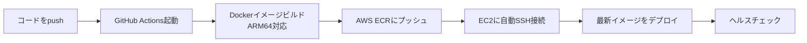

# AST Audio Event Detection API

Audio Spectrogram Transformer (AST) を使用した音響イベント検出APIです。

## ⚠️ このREADMEの前提

このREADMEは現在のコードベース実装に合わせて記述しています。

- 本番で使うAPIサーバーは `main_supabase.py`
- `main.py` と `main_timeline.py` はローカル検証用のスタンドアロンAPI
- APIバージョン表記は `3.0.0` に統一済み

## 🚀 現在の実装要点

### 実装済み機能
- 🎯 **イベントフィルタリング**: 環境変数でON/OFF可能。現在の標準は raw 出力
- 🔄 **ラベル統合**: 環境変数でON/OFF可能。現在の標準は raw 出力
  - 音楽ジャンル → Music
  - 乗り物 → Vehicle
  - エンジン音 → Engine
  - 水の音 → Water
  - 笑い声・泣き声・犬・猫の鳴き声など
- ⚙️ **ON/OFF切り替え**: `event_filter_config.py`で簡単に有効化/無効化
- 📊 **フィルタ設定確認**: `/filter-config`エンドポイントで現在の設定を確認可能

### 既存機能
- 📊 **Supabase統合**: `audio_files` を参照し、結果は `spot_features` に保存
- ☁️ **S3直接アクセス**: AWS S3から音声ファイルを直接取得
- 📈 **ステータス管理**: `spot_features.behavior_status` を更新
- ⚡ **現行デフォルト設定**: 2秒セグメント、50%オーバーラップ、`top_k=5`、`threshold=0.1`
- 🔌 **非同期処理**: `/async-process` が 202 Accepted を返し、バックグラウンド処理後に SQS へ完了通知

---

## 🗺️ ルーティング詳細

| 項目 | 値 | 説明 |
|------|-----|------|
| **🏷️ サービス名** | Behavior Features API | 音響イベント検出（527種類・フィルタリング対応） |
| **📦 モデル** | `MIT/ast-finetuned-audioset-10-10-0.4593` | デフォルトのHugging Face ASTモデル |
| **🧠 バックエンド** | `ast_hf` | 現在コードで実装されている唯一のSED backend |
| | | |
| **🌐 外部アクセス（Nginx）** | | |
| └ 公開エンドポイント | `https://api.hey-watch.me/behavior-analysis/features/` | Lambdaから呼ばれるパス |
| └ Nginx設定ファイル | `/etc/nginx/sites-available/api.hey-watch.me` | 該当箇所を確認 |
| └ proxy_pass先 | `http://localhost:8017/` | 内部転送先 |
| └ タイムアウト | 180秒 | read/connect/send |
| | | |
| **🔌 API内部エンドポイント** | | |
| └ ヘルスチェック | `/health` | GET |
| └ フィルタ設定確認 | `/filter-config` | GET |
| └ **非同期処理（本番の入口）** | `/async-process` | POST - Lambdaが呼ぶ |
| └ **S3統合（直接実行用）** | `/fetch-and-process-paths` | POST - file_paths配列を直接処理 |
| | | |
| **🐳 Docker/コンテナ** | | |
| └ コンテナ名 | `behavior-analysis-feature-extractor` | `docker ps`で表示される名前 |
| └ ポート（内部） | 8017 | コンテナ内 |
| └ ポート（公開） | `127.0.0.1:8017:8017` | ローカルホストのみ |
| └ ヘルスチェック | `/health` | Docker healthcheck |
| └ 自動再起動 | `restart: always` | サーバー再起動時に自動起動 |
| | | |
| **☁️ AWS ECR** | | |
| └ リポジトリ名 | `watchme-behavior-analysis-feature-extractor` | イメージ保存先 |
| └ リージョン | ap-southeast-2 (Sydney) | |
| └ URI | `754724220380.dkr.ecr.ap-southeast-2.amazonaws.com/watchme-behavior-analysis-feature-extractor:latest` | |
| | | |
| **📂 ディレクトリ** | | |
| └ ソースコード | `/Users/kaya.matsumoto/projects/watchme/api/behavior-analysis/feature-extractor-v2` | ローカル |
| └ GitHubリポジトリ | `hey-watchme/api-behavior-analysis-feature-extractor-v2` | |
| └ EC2配置場所 | `/home/ubuntu/behavior-analysis-feature-extractor` | |
| | | |
| **🔗 呼び出し元** | | |
| └ Lambda関数 | `watchme-sed-worker` | SQS: sed-queue |
| └ 呼び出しURL | `https://api.hey-watch.me/behavior-analysis/features/async-process` | フルパス |
| └ 環境変数 | `API_BASE_URL=https://api.hey-watch.me` | Lambda内 |

---

## 概要

Hugging Faceで公開されている事前学習済みモデル `MIT/ast-finetuned-audioset-10-10-0.4593` を使用して、音声ファイルから音響イベント（Speech、Music、Cough、Laughterなど）を検出するWeb APIサーバーです。現在の本番実装は pluggable backend 構成ですが、コード上で利用可能なのは `ast_hf` backend のみです。

## 特徴

- 🎯 **527種類の音響イベント**を検出可能（AudioSetベース）
- 🚀 **Transformerベース**の最新アーキテクチャ
- 📊 **確率スコア付き**でイベントを返す
- 🔧 **FastAPI**による高速なAPIサーバー
- 🎯 **イベントフィルタリング** - `SED_ENABLE_BLACKLIST_FILTER=true` の時のみ適用
- 🔄 **ラベル統合** - `SED_ENABLE_LABEL_MERGE=true` の時のみ適用
- 💾 **保存先** - `spot_features.behavior_extractor_result`
- 📬 **完了通知** - `FEATURE_COMPLETED_QUEUE_URL` にSQS通知

## セットアップ

### 1. 仮想環境の作成（推奨）

```bash
# 仮想環境を作成
python3 -m venv venv

# 仮想環境を有効化
source venv/bin/activate  # macOS/Linux
# または
venv\Scripts\activate     # Windows
```

### 2. 依存ライブラリのインストール

```bash
# requirements.txtからインストール
pip install -r requirements.txt
```

⚠️ **注意**: 初回起動時にモデル（約350MB）が自動ダウンロードされます。

### 3. モデルの動作確認（オプション）

```bash
# テストスクリプトを実行
python3 test_model.py
```

## サーバーの起動

### 本番互換のSupabase統合版（推奨）
```bash
# 環境変数を設定
cp .env.example .env
# .envファイルを編集してSupabaseとAWSの認証情報を設定

# APIサーバーを起動（ポート8017で動作）
python3 main_supabase.py
```

### スタンドアロン版（ローカル検証用）
```bash
# 単発分析API
python3 main.py

# 時系列分析API
python3 main_timeline.py
```

起動成功時の表示:
```
==================================================
Audio Event Detection API with Supabase
Backend: ast_hf
Model: MIT/ast-finetuned-audioset-10-10-0.4593
==================================================
🔄 Loading model backend=ast_hf, model=MIT/ast-finetuned-audioset-10-10-0.4593
✅ Model loaded successfully
INFO:     Started server process [xxxxx]
INFO:     Waiting for application startup.
INFO:     Application startup complete.
INFO:     Uvicorn running on http://127.0.0.1:8017
```

## APIの使用方法

### 利用可能なサーバー

このプロジェクトには3つのAPIサーバーがあります：

1. **`main_supabase.py`** - 本番互換。S3/Supabase/SQS連携、`/async-process` と `/fetch-and-process-paths` を提供
2. **`main.py`** - ローカル用の基本音響イベント検出
3. **`main_timeline.py`** - ローカル用の時系列分析API

### サーバーの起動

```bash
# 本番互換の起動
python3 main_supabase.py
```

### ヘルスチェック

```bash
# サーバーの状態を確認
curl http://localhost:8017/health
```

レスポンス例:
```json
{
  "status": "healthy",
  "model_loaded": true,
  "backend": "ast_hf",
  "model_name": "MIT/ast-finetuned-audioset-10-10-0.4593",
  "sampling_rate": 16000,
  "supabase_connected": true,
  "s3_connected": true
}
```

## エンドポイント

### Supabase統合版エンドポイント

#### POST `/async-process` - 本番の非同期処理入口

Lambda `watchme-sed-worker` が呼ぶ本番用エンドポイントです。即時に `202 Accepted` を返し、バックグラウンドで処理します。

```bash
curl -X POST "http://localhost:8017/async-process" \
  -H "Content-Type: application/json" \
  -d '{
    "file_path": "files/d067d407-cf73-4174-a9c1-d91fb60d64d0/2025-07-20/00-00/audio.wav",
    "device_id": "d067d407-cf73-4174-a9c1-d91fb60d64d0",
    "recorded_at": "2025-07-20T00:00:00+00:00"
  }'
```

#### POST `/fetch-and-process-paths` - file_pathsベースの直接実行

S3上の file path を直接指定して処理するエンドポイントです。ローカル検証や一括実行に向いています。

```bash
curl -X POST "http://localhost:8017/fetch-and-process-paths" \
  -H "Content-Type: application/json" \
  -d '{
    "file_paths": [
      "files/d067d407-cf73-4174-a9c1-d91fb60d64d0/2025-07-20/00-00/audio.wav"
    ],
    "threshold": 0.1,
    "top_k": 3,
    "analyze_timeline": true,
    "segment_duration": 10.0,
    "overlap": 0.0
  }'
```

##### パラメータ
- `file_paths`: S3ファイルパスの配列（必須）
- `threshold`: 最小確率しきい値（オプション、デフォルト: 0.1）
- `top_k`: 返す予測結果の数（オプション、デフォルト: 5）
- `analyze_timeline`: リクエスト項目としては受け付けるが、現行実装では分岐に未使用
- `segment_duration`: セグメントの長さ（秒）（オプション、デフォルト: 2.0）
- `overlap`: オーバーラップ率（オプション、デフォルト: 0.5）

##### デフォルト設定について
**2秒セグメント（50%オーバーラップ）**を現行デフォルトにしています。短い感情音や一瞬の物音を落としにくくするための高感度設定です。処理負荷は増えますが、raw寄りの観察用途を優先しています。

##### レスポンス例
```json
{
  "status": "success",
  "summary": {
    "total_files": 1,
    "processed": 1,
    "errors": 0
  },
  "processed_files": ["files/.../audio.wav"],
  "error_files": null,
  "execution_time_seconds": 8.7,
  "message": "1件中1件を正常に処理しました"
}
```

##### データベース更新
このエンドポイントは以下のテーブルを自動的に更新します：

1. **audio_files**テーブル
   - `file_path` から対象レコードを検索
   - `local_date` と `local_time` を参照

2. **spot_features**テーブル
   - `behavior_status`: `processing` → `completed` または `failed`
   - `behavior_extractor_result` にタイムライン形式のAST結果を保存
   - `device_id` と `recorded_at` をキーにUPSERT
   
   保存形式：
   ```json
   [
     {"time": 0.0, "events": [{"label": "Speech", "score": 0.85}, ...]},
     {"time": 10.0, "events": [{"label": "Music", "score": 0.72}, ...]},
     {"time": 20.0, "events": [{"label": "Silence", "score": 0.91}, ...]},
     ...
   ]
   ```

### スタンドアロン版エンドポイント

以下は `main.py` / `main_timeline.py` 用です。本番コンテナの `main_supabase.py` には含まれません。

#### 1. `/analyze_sound` - 音声ファイル全体の分析

音声ファイル全体から主要な音響イベントを検出します。

```bash
# 音声ファイルをアップロードして分析
curl -X POST "http://localhost:8017/analyze_sound" \
  -F "file=@test_audio.wav" \
  -H "accept: application/json"
```

#### パラメータ
- `file`: 音声ファイル（必須）
  - 対応形式: WAV, MP3, FLAC, OGG, M4A
- `top_k`: 返す予測結果の数（オプション、デフォルト: 5）

#### レスポンス例
```json
{
  "predictions": [
    { "label": "Speech", "score": 0.8521 },
    { "label": "Music", "score": 0.0754 },
    { "label": "Cough", "score": 0.0213 },
    { "label": "Laughter", "score": 0.0152 },
    { "label": "Silence", "score": 0.0081 }
  ],
  "audio_info": {
    "filename": "test_audio.wav",
    "duration_seconds": 10.5,
    "sample_rate": 16000
  }
}
```

### 2. `/analyze_timeline` - 時系列分析（新機能）

音声を時系列で分析し、1秒ごとの音響イベントを検出します。

```bash
# 時系列分析（1秒ごと、50%オーバーラップ）
curl -X POST "http://localhost:8017/analyze_timeline" \
  -F "file=@test_audio.wav" \
  -F "segment_duration=1.0" \
  -F "overlap=0.5" \
  -F "top_k=3"
```

#### パラメータ
- `file`: 音声ファイル（必須）
- `segment_duration`: セグメントの長さ（秒）（オプション、デフォルト: 1.0）
- `overlap`: オーバーラップ率 0-1（オプション、デフォルト: 0.5）
- `top_k`: 各時刻で返すイベント数（オプション、デフォルト: 3）

#### レスポンス例
```json
{
  "timeline": [
    {
      "time": 0.0,
      "events": [
        { "label": "Speech", "score": 0.7521 },
        { "label": "Background noise", "score": 0.1234 },
        { "label": "Music", "score": 0.0521 }
      ]
    },
    {
      "time": 0.5,
      "events": [
        { "label": "Cough", "score": 0.8921 },
        { "label": "Throat clearing", "score": 0.0621 },
        { "label": "Speech", "score": 0.0234 }
      ]
    }
  ],
  "summary": {
    "total_segments": 78,
    "duration_seconds": 39.9,
    "segment_duration": 1.0,
    "overlap": 0.5,
    "most_common_events": [
      {
        "label": "Speech",
        "occurrences": 47,
        "average_score": 0.352
      }
    ]
  },
  "audio_info": {
    "filename": "test_audio.wav",
    "duration_seconds": 39.9,
    "sample_rate": 16000
  }
}
```

## S3統合機能

AWS S3から直接音声ファイルを取得して分析できます。

### S3音声ファイルの分析

```bash
# 基本的な分析
python3 analyze_s3_audio.py

# 時系列分析
python3 analyze_s3_timeline.py

# カスタムS3パスを指定
python3 analyze_s3_timeline.py "files/device_id/date/time/audio.wav"
```

### 必要な環境変数（.env）

```env
# AWS S3設定
AWS_ACCESS_KEY_ID=your_access_key
AWS_SECRET_ACCESS_KEY=your_secret_key
S3_BUCKET_NAME=your_bucket
AWS_REGION=us-east-1
```

### 出力ファイル

時系列分析を実行すると、以下のファイルが生成されます：

- `timeline_result.json` - 完全な時系列データ
- `timeline.csv` - CSV形式の時系列データ（Excel等で開ける）
- `analysis_result.json` - 全体分析の結果

## テスト用音声ファイルの作成

macOSの場合、以下のコマンドで簡単なテスト音声を録音できます:

```bash
# 5秒間の音声を録音
rec -r 16000 -c 1 test_audio.wav trim 0 5

# または、macOSの標準コマンドで
say "This is a test audio for AST model" -o test_speech.wav --data-format=LEI16@16000
```

## 検出可能な音響イベントの例

このモデルはAudioSetデータセットで学習されており、以下のような音響イベントを検出できます:

### 人間の音
- Speech（会話）
- Laughter（笑い声）
- Cough（咳）
- Sneeze（くしゃみ）
- Crying（泣き声）
- Singing（歌声）

### 環境音
- Music（音楽）
- Silence（静寂）
- Door（ドアの音）
- Footsteps（足音）
- Applause（拍手）

### その他
- 動物の鳴き声
- 楽器の音
- 機械音
- 自然音

完全なリストは527種類のカテゴリを含みます。

## トラブルシューティング

### モデルのダウンロードが遅い

初回起動時にHugging Faceからモデルをダウンロードするため、ネットワーク環境によっては時間がかかることがあります。モデルは `~/.cache/huggingface/` にキャッシュされます。

### メモリ不足エラー

ASTモデルは比較的大きいため、最低4GB以上のRAMが推奨されます。

### ポート8017が使用中

```bash
# 使用中のプロセスを確認
lsof -i :8017

# 別のポートで起動する場合はmain.pyを編集
# port=8017 を port=8018 などに変更
```

## 技術詳細

- **モデル**: MIT/ast-finetuned-audioset-10-10-0.4593
- **アーキテクチャ**: Audio Spectrogram Transformer (AST)
- **入力**: 16kHz サンプリングレートの音声
- **出力**: 527クラスの確率分布
- **フレームワーク**: PyTorch + Transformers

## 🚀 本番環境デプロイ（現行構成）

### 🎉 実装上の重要点

`Dockerfile.prod` は `main_supabase.py` をそのままコピーし、`uvicorn main_supabase:app` で起動します。つまり本番コンテナの実体は Supabase統合版です。

### ✅ インフラ情報
- **ECRリポジトリ**: `754724220380.dkr.ecr.ap-southeast-2.amazonaws.com/watchme-behavior-analysis-feature-extractor`
- **本番環境**: EC2サーバー（3.24.16.82）で正常稼働中
- **エンドポイント**: `https://api.hey-watch.me/behavior-analysis/features/`
- **ポート**: **8017**（統一）
- **コンテナ名**: `behavior-analysis-feature-extractor`
- **ネットワーク**: `watchme-network`

### 🚀 自動デプロイ（CI/CD）

#### 1. 通常のデプロイ（mainブランチへのプッシュ）
```bash
# コードの変更をコミット
git add .
git commit -m "feat: 新機能の追加"

# mainブランチにプッシュ → 自動デプロイ開始
git push origin main
```

**これだけで以下が自動実行されます:**
1. Dockerイメージのビルド（ARM64対応）
2. AWS ECRへのプッシュ
3. EC2サーバーへの自動デプロイ
4. ヘルスチェック

#### 2. 手動実行（GitHub Actions UI）
1. GitHubリポジトリの「Actions」タブを開く
2. 「Deploy to Amazon ECR and EC2」ワークフローを選択
3. 「Run workflow」ボタンをクリック

#### 3. デプロイ状況の確認
- GitHub Actions: リポジトリの「Actions」タブで進捗確認
- デプロイ完了後: `https://api.hey-watch.me/behavior-analysis/features/health`

### 📋 CI/CDパイプラインの流れ



### 🔧 必要な設定（すべて設定済み）

#### GitHub Secrets（設定済み）
- `AWS_ACCESS_KEY_ID`
- `AWS_SECRET_ACCESS_KEY` 
- `EC2_SSH_PRIVATE_KEY`
- `EC2_HOST`
- `EC2_USER`

#### EC2側の設定
- **アプリケーションディレクトリ**: `/home/ubuntu/behavior-analysis-feature-extractor`
- **環境変数**: `/home/ubuntu/behavior-analysis-feature-extractor/.env`
- **デプロイスクリプト**: `./run-prod.sh`

### ⚠️ ポート設定の注意
Behavior Features API は **8017ポート** で動作します：
```yaml
# docker-compose.prod.yml
ports:
  - "127.0.0.1:8017:8017"  # ポート8017で統一
```

### 📝 手動デプロイ（非推奨・緊急時のみ）

CI/CDが利用できない場合の手動デプロイ方法：

```bash
# 1. EC2にSSH接続
ssh -i ~/watchme-key.pem ubuntu@3.24.16.82

# 2. アプリケーションディレクトリに移動
cd /home/ubuntu/behavior-analysis-feature-extractor

# 3. デプロイスクリプト実行
./run-prod.sh
```

### 運用コマンド

#### SSH接続
```bash
# 本番環境へのSSH接続
ssh -i ~/watchme-key.pem ubuntu@3.24.16.82
```

#### サービス管理
```bash
# コンテナ状態確認
docker ps | grep behavior-analysis-feature-extractor

# ログ確認
docker logs behavior-analysis-feature-extractor --tail 50 -f

# 再起動
cd /home/ubuntu/behavior-analysis-feature-extractor
docker-compose -f docker-compose.prod.yml restart

# ヘルスチェック
curl http://localhost:8017/health
```

### API利用例
```bash
# 本番環境での利用
curl -X POST "https://api.hey-watch.me/behavior-analysis/features/async-process" \
  -H "Content-Type: application/json" \
  -d '{
    "file_path": "files/device_id/date/time/audio.wav",
    "device_id": "device_id",
    "recorded_at": "2025-07-20T00:00:00+00:00"
  }'
```

## ライセンス

このプロトタイプは検証用です。モデル自体のライセンスはMITライセンスに従います。

## 参考資料

- [AST論文](https://arxiv.org/abs/2104.01778)
- [Hugging Face Model Card](https://huggingface.co/MIT/ast-finetuned-audioset-10-10-0.4593)
- [AudioSetデータセット](https://research.google.com/audioset/)
